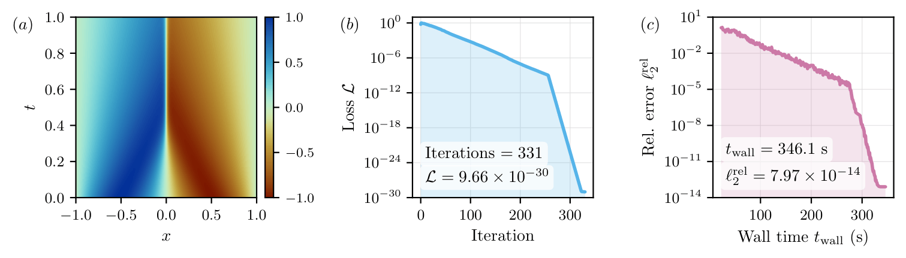

# Physics-Informed Neural Networks

A JAX/Equinox framework for solving PDEs with physics-informed neural networks
(PINNs).

A Doubly-Sketched Gauss–Newton model with novel Adaptive Ratio steps (**DSGNAR**) trains the network in single (`train32`)
or double (`train64`) precision, reaching machine limit accuracy on a suite of problems.

[](https://arxiv.org/abs/XXXX.XXXXX)
[](assets/paper.pdf)

> **An Optimisation Framework for the Well-Conditioned Training of
> Physics-Informed Neural Networks**
> Joseph Webb, Sadok Jerad, Coralia Cartis – Mathematical Institute, University of Oxford

<p align="center">
  
</p>

<p align="center"><sub>
Burgers' equation solved in double precision: relative ℓ₂ error of
7.97×10⁻¹⁴ in 331 iterations / 346.1 s on a single NVIDIA H100. See the paper for the full suite of results.
</sub></p>

Included examples: Burgers, KdV, Kuramoto–Sivashinsky, wave, multi-scale
Laplacian, lid-driven cavity, and Poisson in 5D/10D.

## Installation

Requires **Python 3.12** and an **NVIDIA GPU with CUDA 12**.

```bash
git clone https://github.com/wephy/physics-informed-neural-networks.git
cd physics-informed-neural-networks

python3.12 -m venv .venv
source .venv/bin/activate

pip install --upgrade pip
pip install -r requirements.txt
```

`requirements.txt` installs the pinned dependencies and the `pinn` package
itself (editable), so `import pinn` works from any directory. Verify the GPU is
visible:

```bash
python -c "import jax; print(jax.__version__); print(jax.devices())"
```

You should see a `CudaDevice` in the list.

## Getting started

Open `burgers_demo.ipynb` for a complete, self-contained run.

## Defining a problem

A `Problem` provides two dictionaries keyed by condition name:

- `residual_fns()` — `name -> (model, coords) -> residual`.
- `samplers()` — `name -> sampler`.  

Recognised condition names include `pde`, `bc`, `ic`, and `ic_t` (initial time derivative). Time-dependent problems set `t_max` and are able to be solved in intervals. Initial conditions are matched against a target supplied by `analytical_ic` on the first interval and by the previous interval thereafter. The optimiser is configured entirely through `RunConfig` (`src/pinn/config.py`), and its design – the doubly-sketched Gauss–Newton model with adaptive-ratio step selection – is described in full in the paper.

## Project layout

| Path | Purpose |
|------|---------|
| `src/pinn/problem.py` | `Problem` base interface |
| `src/pinn/operators.py` | derivative helpers for residuals |
| `src/pinn/sampling.py` | collocation-point samplers |
| `src/pinn/networks.py` | network architectures (`MLP`, `SIREN`, `GaborNet`, `SPINN`) |
| `src/pinn/config.py` | `RunConfig` — all run settings |
| `src/pinn/trainer32.py`, `trainer64.py` | training loops (single / double precision) |
| `src/pinn/optimiser.py` | sketched trust-region optimiser (DSGNAR) |
| `src/pinn/plotting.py` | live training dashboard |
| `src/pinn/reference.py` | reference-solution loader |
| `src/pinn/references/` | reference solutions (`.npz`) |
| `scripts/generate_references.py` | regenerate the reference solutions |
| `examples/` | one runnable notebook per problem |

## Reference solutions

Each example scores its network against a reference solution in
`src/pinn/references/`. Regenerate them with:

```bash
python scripts/generate_references.py burgers
```

The lid-driven cavity reference is a [Dedalus](https://dedalus-project.org)
spectral solution and is shipped as data rather than regenerated by the script.